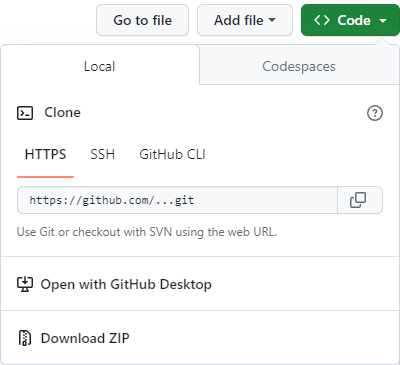

# Лабораторная работа по отладке

Порядок выполнения:

1. Скачать файлы с репозитория. На github нажать на кнопку `<> Code`, в выпадающем окне нажать Download ZIP.
1. Распаковать архив в папку с вашими проектами.
1. С помощью консоли перейти в данную папку и выполнить команды:
    1. `python -m venv venv` - создает виртуальное окружение, чтобы все пакеты ставились затем в него.
    1. `.\venv\Scripts\activate` - на windows активирует созданное окружение.
    1. `pip install pytest` - устанавливает пакет pytest в созданное виртуальное окружение.

Если при активации окружения возникает ошибка "...Scripts\Activate.ps1 cannot be loaded because running scripts is disabled on this system." необходимо запустить PowerShell с правами администратора и выполнить команду `Set-ExecutionPolicy RemoteSigned`. Затем перезагрузить PowerShell и ошибка уйдет.

## Задание 1

1. Установите точку останова вначале блока цикла for и отслеживайте значения переменных num и min_num во время каждой итерации цикла. Для этого выполните следующие шаги:
1. С помощью pdb установите точку останова. Если у вас Python до версии 3.7, то в начале модуля необходимо импортировать pdb добавив строку `import pdb` и в точке останова написать `pdb.set_trace()`. Если версия python свежее, то только в месте останова напишите `breakpoint()`. Проверить версию установленного Python можно командой в терминале `python --version`.
1. Запустите код задачи командой `python task1.py`. Если вы увидели `...\task2.py(7)find_minimum() -> if num < min_num: (Pdb)` значит все правильно и вы вошли в режим отладки в pdb.
1. Начните с просмотра всех локальных переменных введя `locals()`. Сохраните вывод, чтобы добавить его потом в отчет.
1. Выведите значения интересующих нас переменных с помощью команды `p num, min_num`, где `p` это сокращение от `print`.
1. Далее вы можете перемещаться по исполнению кода с помощью команд `c` (`continue` - продолжить выполнение программы до следующей точки останова или до конца) или `n` (`next` - выполнить следующую строку кода).
1. Ваша задача проследить за тем как меняются значения переменных `num` и `min_num`, посчитать сколько раз вы прошли в цикле и сколько раз изменилось значение `min_num`. Результаты выписать в отчет.
1. В отчете после титульного листа, приведите список локальных переменных с их значениям в начале исполнения кода, покажите историю изменений переменных `num` и `min_num`, и приложите скриншот вашей работы в отладчике pdb.

## Задание 2

1. Отладьте функцию calculate, в которой есть самые разнообразные ошибки от синтаксических до логических. Она принимает 3 значения: первое и третье значения - числа, второе значение - символ "+", "-", "*" или "/", функция возвращает результат соответствующей математической функции над двумя числами. В остальных случаях возвращается None.
1. Для отладки можете менять варианты в 14-й строке, запускать код с помощью `python task2.py` и используя инструменты отладки в редакторе кода, pdb или в крайнем случае print, наладить работу функции.
1. Для проверки на исправленные логические ошибки запускайте тесты с помощью команды `pytest test_task2.py`.
1. Если какие-то тесты вы не прошли (стоит буква F), то необходимо поправить реализацию функции и снова запустить тесты. И так пока все тесты не будут пройдены.
1. Для защиты работы подготовьте краткий отчет, в котором после титульного листа разместите листинг до исправлений и после, снимок экрана с сообщением о прохождении всех тестов из консоли, а также описание последовательности действий как вы проводили отладку, куда добавляли print, где устанавливали точки останова.

## Задание 3

1. В функции add_matrices допущено две логические ошибки. Ваша задача найти их и исправить.
1. Для отладки используйте знания полученные в предыдущих заданиях.
1. Для проверки своего решения запускайте тесты с помощью команды `pytest test_task3.py`.
1. Если какие-то тесты вы не прошли (стоит буква F), то необходимо поправить реализацию функции и снова запустить тесты. И так пока все тесты не будут пройдены.
1. Для защиты работы подготовьте краткий отчет, в котором после титульного листа разместите листинг файла task3.py после исправления, снимок экрана с сообщением о прохождении всех тестов из консоли, а также описание последовательности действий как вы искали ошибки.